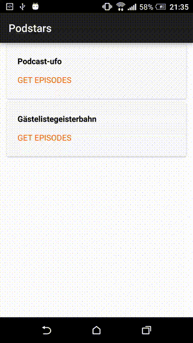

# Android DownloadManager support for Titanum 

Use the Android default DownloadManager to download files in the background. It will open the system download list when you click on the notification.

~~~javascript
var dmg = require("com.miga.downloadmanager");

var filename = url.substring(url.lastIndexOf('/') + 1);
var file = Ti.Filesystem.getFile(Ti.Filesystem.externalStorageDirectory, filename).nativePath;

dmg.setAllowedNetworks(Ti.Network.NETWORK_WIFI)

dmg.startDownload({
    url: url,
    filename: file,
    success: onDone,
    title: "Download",
    description: "Download " + filename
});

dmg.getAllDownloads();
dmg.getPendingDownloads();
dmg.getFailedDownloads();
dmg.getPausedDownloads();
dmg.getRunningDownloads();
dmg.getSuccessfulDownloads();
dmg.getStatusOfDownload(url);

function onDone(){
	alert("done");
}
~~~
